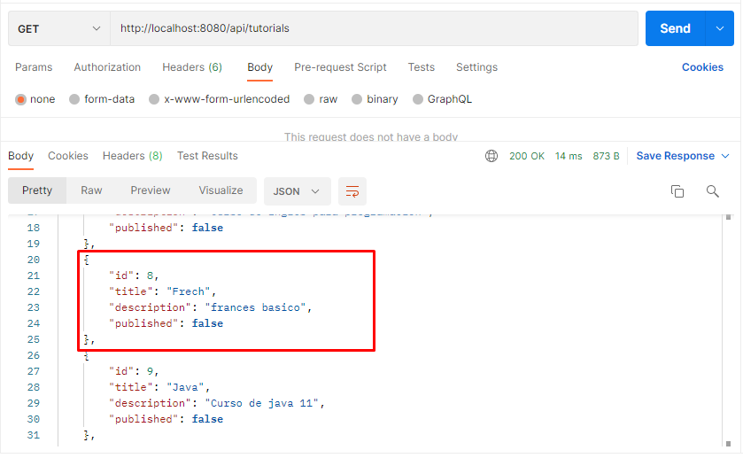
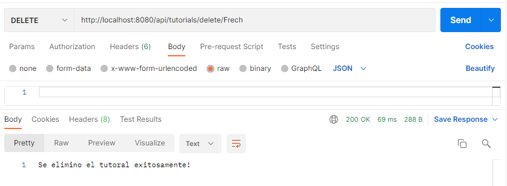
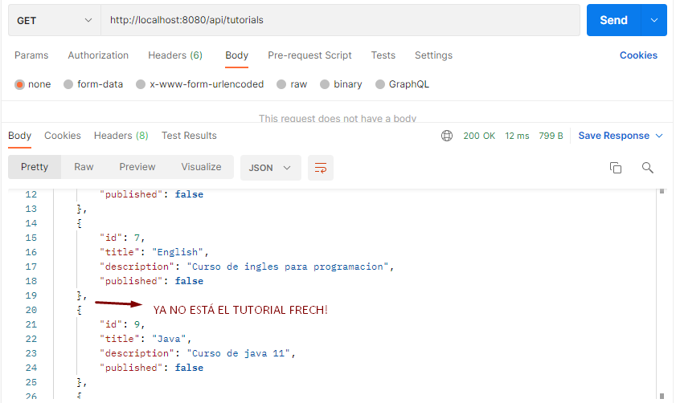

# Spring Boot JPA MySQL - Building Rest CRUD API example
"# API-rest-FULL-Tutorials" 

**_Maycol Rincon_**

## Methods
### 1. deleteByTitle
elimina el tutorial por el titulo ingresado en el endpoint.  
 - path --> http://localhost:8080/api/tutorials/delete/{title}
 - request http : DELETE
 - devuelve un string de confirmacion o falla en el programa

Screenshots:

se eliminara Frech

Se escribe la ruta para el request: devuelve un string con el tutorial eliminado exitosamente

El tuturial Frech se eliminó de la base de datos.

### 2. 
