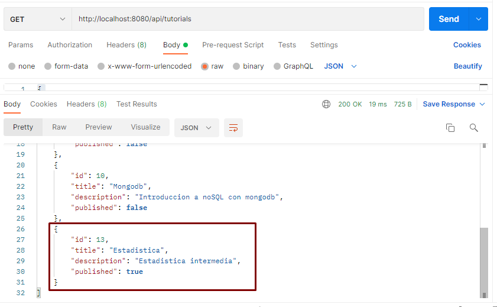
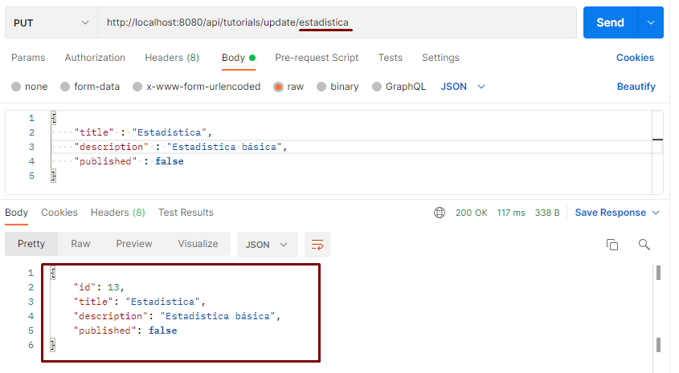
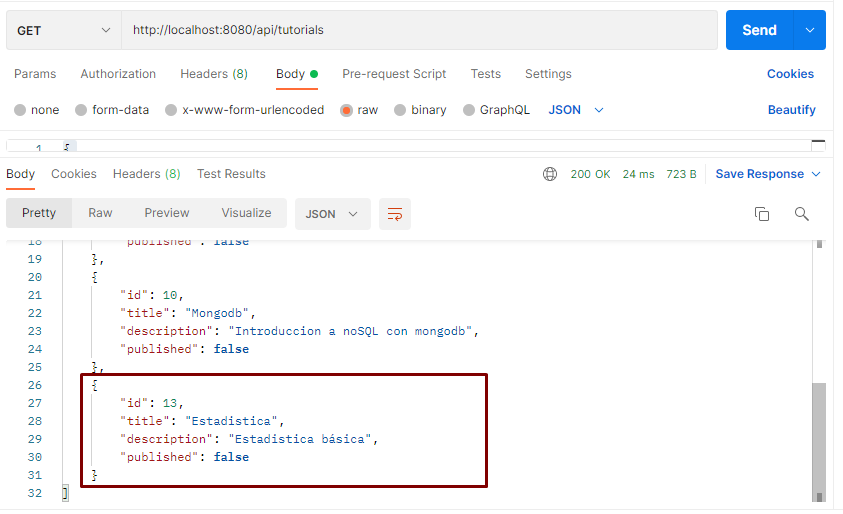

# Spring Boot JPA MySQL - Building Rest CRUD API example
"# API-rest-FULL-Tutorials" 

**_Maycol Rincon_**

## Methods
### 1. deleteByTitle
elimina el tutorial por el titulo ingresado en el endpoint.  
 - path --> http://localhost:8080/api/tutorials/delete/{title}
 - request http : DELETE
 - devuelve un string de confirmacion o falla en el programa

Screenshots:

_se eliminara Frech_

_Se escribe la ruta para el request: devuelve un string con el tutorial eliminado exitosamente_

_El tuturial Frech se eliminó de la base de datos._

### 2. updateByTitle
Actualiza el tutorial por el titulo ingresado

- path --> http://localhost:8080/api/tutorials/update/{title}
- Request http : PUT
- Devuelve la entitdad

screenshots:  
_Se identifica el tutorial a actualizar_

_Se escribe el titulo en el path, luego se modifica description y published_

_Los cambios fueron guardados correctamente_

